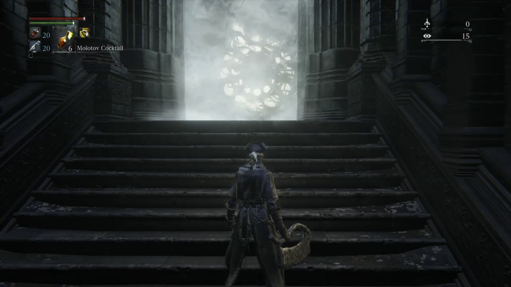
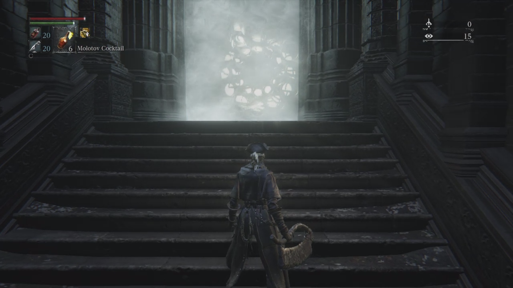
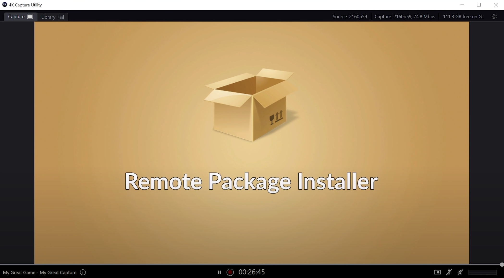

# Chiaki

 

Fixed YUV420P to RGB conversion, which produced color inaccuracies.

**Original repo**: https://git.sr.ht/~thestr4ng3r/chiaki.

## Comparisons
A few image comparisons, since it might be hard to notice (otherwise they would've fixed it already?).

### Bloodborne
Original Chiaki

Fixed

### Remote Package Installer
Original Chiaki

Fixed

Capture Card

(Credit to MODDED WARFARE)

## Download
Download the latest release from here: https://github.com/Egoistically/chiaki/releases/latest.

If you want to patch it yourself, [here's the the code changed](https://github.com/Egoistically/chiaki/blob/master/gui/src/avopenglwidget.cpp#L32) (adapted from here: https://stackoverflow.com/q/55930123).

Because AppVeyor updates their images every so often, some changes might need to be made in the future.